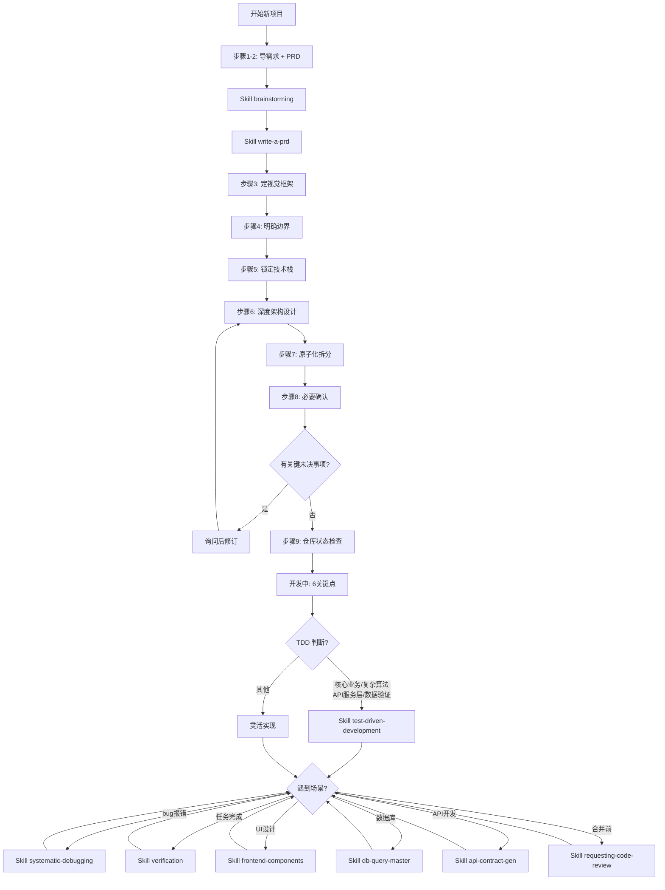

# VC 工作流

> 你负责边界和验收，AI负责干活
>
> 触发词：`vc` | `vibecoding`

以下步骤只在用户明确选择本流程后适用，按真实任务合并或省略无关步骤。已有项目优先；方案默认留在对话中，用户要求文档时再落盘。下游 Skill 需先确认存在，不自动安装；任何步骤都不构成 Git 提交、发布、付费或生成媒体的额外授权。

---

## 🚀 快速执行锚点

| 触发词 | 执行 |
|--------|------|
| 新项目/开始/创建 | 从**步骤1：导需求**开始 |
| 重构/屎山/失控 | 从**步骤1**重新开始 |
| 继续/接着做 | 读取 PROJECT.md 按计划继续 |
| bug/报错/失败 | `Skill({name:"systematic-debugging"})` |
| 核心业务/复杂逻辑 | TDD 判断 → 是则调用 `test-driven-development` |

**场景自动触发**：

| 场景 | 调用 |
|------|------|
| 任务完成 | `Skill({name:"verification-before-completion"})` |
| UI设计 | `Skill({name:"frontend-components"})` |
| 数据库 | `Skill({name:"db-query-master"})` |
| API开发 | `Skill({name:"api-contract-gen"})` |
| 合并前 | `Skill({name:"requesting-code-review"})` |

> 在本流程内按当前任务调用已存在的必要能力，不重复确认已明确的需求，也不越过需要授权的操作。

---

## 📋 核心流程图



---

## 🏗️ 开发前：9个步骤

### 步骤1-3：定图纸

**步骤1**：导需求 → `brainstorming`
- 明确：痛点、用户、场景、核心功能、验收标准

**步骤2**：整理PRD → `write-a-prd`
- 重点：每个功能必须有验收标准

**步骤3**：定视觉框架
- 确定：导航栏、页面区块、整体风格

---

### 步骤4-6：打地基

**步骤4**：明确边界
- Q1：本地自用还是上线公开？
- Q2：有没有用户数据/支付/隐私合规？
- Q3：性能和成本有没有上限？

**步骤5**：锁定技术栈
- 原则：**越可验证越好**（资料多、工具链成熟、能跑测试）

**步骤6**：深度架构设计
- 按任务涉及的边界说明目录、模块、数据流和异常策略；简单任务不做完整架构设计。用户要求文档时才输出 `ARC.md`。

---

### 步骤7-9：立规矩

**步骤7**：原子化拆分 → `writing-plans`
- 任务按独立可验证的结果拆分，不强制切成固定时长。
- 默认在对话中给必要步骤；用户要求任务文档时才输出 `TASK.md`。

**步骤8**：必要确认
- 检查：完整性、一致性、可行性、可控性、可测性
- 需求明确且已授权时直接执行；只有关键缺失信息或需要额外授权时提问。用户要求先给方案或平台要求审批时，必须等相应确认。

**步骤9**：仓库状态检查
- 确认真正的项目根和既有改动，按需检查 `git status` / `git diff`。不自动初始化仓库、暂存或提交；这些动作须有用户当前明确要求。

---

## ⚙️ 开发中：6个关键点

### 关键点1：TDD 判断 + 原子化迭代

**TDD 判断**：任务涉及核心业务/复杂算法/API服务层/数据验证？
- 是 → 调用 `test-driven-development`，执行 RED→GREEN→REFACTOR 循环
- 否 → 灵活实现

**原子化迭代（按已确认需求或现有任务文档执行）**：
- 任务1：初始化项目 → 任务2：配置路由 → 任务3：开发登录页 → ...

**每个任务完成后**：
1. ✅ 验证通过
2. ✅ 跑测试 / 过Lint
3. ✅ 按需更新与变更直接相关的已有文档，不强制新建流程文档
4. ✅ 检查 Git 差异，保留无关改动，不自动暂存或提交

---

### 关键点2：人类介入

- 单文件 <500行，单组件 <300行
- 提示词模板：`只改我点名的文件范围，不要顺手重构`

---

### 关键点3：相关文档维护

**任务开始时**：
- 如已有任务文档则读取，确认当前任务和依赖；不存在时不为流程造文档。

**用户明确需要完整流程文档时，可按以下对应关系维护；否则只更新受当前变更影响的已有内容**：
| 完成项 | 更新文档 |
|--------|----------|
| 需求确认 | 更新 PRD.md 验收标准 |
| 架构设计 | 更新 ARC.md |
| 任务拆分 | 更新 TASK.md |
| 审批通过 | 创建 `docs/approval/YYYY-MM-DD-approval.md` |
| 任务执行 | 更新 PROJECT.md 进度 + 标记 TASK.md 完成 |

---

### 关键点4：安全底线

- API Key 不进前端，用环境变量
- 密码不存 LocalStorage
- SQL注入用参数化查询，XSS用输出转义

---

### 关键点5：科学报错

**两次无新增证据就停**
1. 最小复现
2. 加日志/断点
3. 写测试

---

## 📁 项目文档结构

以下是用户明确要求完整文档时的可选结构，不是每次任务的必建清单。

```
项目根目录/
├── docs/
│   ├── prd/                           # PRD文档目录
│   │   └── YYYY-MM-DD-prd.md        # 日期命名的详细PRD
│   ├── plans/                         # 设计文档目录
│   │   └── YYYY-MM-DD-design.md     # 架构设计方案
│   ├── tasks/                         # 原子任务目录
│   │   └── YYYY-MM-DD-tasks.md      # 任务拆分清单
│   └── approval/                      # 审批记录目录
│       └── YYYY-MM-DD-approval.md   # 审批确认记录
├── PRD.md                             # 核心PRD（简化版根目录入口）
├── ARC.md                             # 架构设计文档
├── TASK.md                            # 原子任务清单（根目录快捷方式）
└── PROJECT.md                         # 项目进度追踪
```

**说明**：
- `docs/prd/` - 保存完整PRD文档，含功能列表、用户流程、验收标准
- `docs/plans/` - 保存架构设计文档，含目录结构、数据模型、接口契约
- `docs/tasks/` - 保存原子任务清单，含任务依赖图、输入输出验收
- `docs/approval/` - 保存审批记录，确保流程可追溯
- 根目录 `PRD.md/ARC.md/TASK.md` 是快捷入口，指向最新版本

---

## 🔗 配套技能调用表

| 场景 | 调用 |
|------|------|
| bug/报错 | `systematic-debugging` |
| 任务完成 | `verification-before-completion` |
| UI设计 | `frontend-components` |
| 数据库 | `db-query-master` |
| API开发 | `api-contract-gen` |
| 合并前 | `requesting-code-review` |
| 核心功能/复杂逻辑 | `test-driven-development` ⭐ |
| 需求澄清 | `brainstorming` |
| PRD文档 | `write-a-prd` |
| 实施计划 | `writing-plans` |

---

## 🎯 执行检查清单

### 开发前9步骤
1. 导需求（brainstorming）
2. 整理PRD（write-a-prd）
3. 定视觉框架
4. 明确边界
5. 锁定技术栈
6. 深度架构设计
7. 原子化拆分（writing-plans）
8. 必要确认（缺失信息、授权或平台审批）
9. 仓库状态检查

### 开发中7关键点
1. TDD判断 + 原子化迭代
2. 人类介入
3. 相关文档维护（按需）
4. 安全底线
5. 科学报错
6. 代码拆分
7. TDD质量门控

---

## 💡 记住

1. 先理解真实需求，跳过不适用的流程步骤
2. 只对关键未决事项或额外授权确认，不重复审批已明确的小任务
3. 按可验证结果迭代，不强制创建任务文档
4. TDD判断优先：核心业务必须TDD
5. 核心业务和复杂逻辑用测试驱动，视觉与布局修改做匹配风险的可运行验收
6. 人类做主：AI是执行者，不是决策者
7. 不自动生成流程文档、安装依赖或提交 Git；同步维护确实受影响的已有文档
